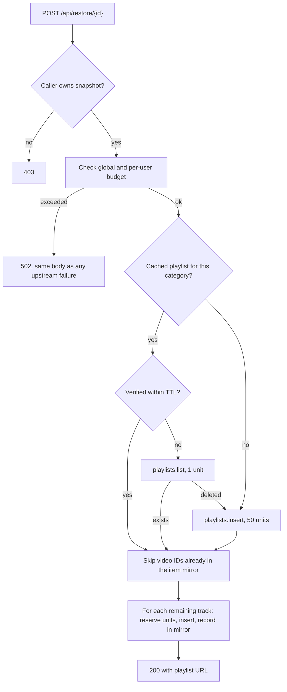

# Architecture

This document describes how the backend is organized, how a restore request flows through it, and what is persisted.

## Components

| Module | Responsibility |
|---|---|
| `main.py` | HTTP routes, middleware (CORS, security headers, body limits, rate limits), global error handling |
| `auth.py` | Verifies Google ID tokens and access tokens, issues and validates RS256 session JWTs, tracks revoked sessions |
| `crypto.py` | AES-256-GCM envelope encryption for stored OAuth tokens, key IDs, and rotation |
| `ytm_service.py` | Restore engine: playlist lookup, deduplication, sequential inserts, retry policy |
| `quota.py` | Per-user and global usage ledger keyed to the Pacific day, budget checks, circuit breaker |
| `models.py` | SQLAlchemy models |
| `schemas.py` | Pydantic request and response schemas (strict, bounded) |
| `migrations.py` | Additive, idempotent migrations applied at startup |
| `config.py` | Environment-driven configuration; refuses to boot in production with missing secrets |
| `audit.py` | Structured audit logging with token redaction |

## Data Model

| Table | Purpose |
|---|---|
| `users` | Google identity, encrypted OAuth token blob, `needs_reconnect` flag |
| `playlist_snapshots` | A saved queue, owned by one user, tagged with a category |
| `user_playlists` | Maps `(user_id, category)` to the YouTube playlist created for it |
| `playlist_items_cache` | Video IDs known to be in each YouTube playlist (local mirror) |
| `quota_usage` | Units spent per user per Pacific day, plus playlists created that day |
| `revoked_tokens` | Session token IDs (`jti`) invalidated by logout |

Deleting a user cascades to snapshots, cached playlists, the item mirror, and quota records.

## Restore Flow

Key properties of this flow:

- **Budget is checked before any network call**, and units are reserved before each attempt, so retries cannot overspend.
- **The mirror is updated immediately after each successful insert**, which makes retries idempotent.
- **Inserts are sequential.** Parallel inserts to one playlist produced `409 ABORTED` conflicts.
- **Quota errors (`403 quotaExceeded`, `429`) are never retried.** Only `5xx` and transient `409` are, with capped exponential backoff and jitter.

## Authentication Flow

1. The extension obtains a Google token through `chrome.identity` and posts it to `/api/auth/register`.
2. The backend verifies the token (signature, audience, issuer, expiry for ID tokens; `tokeninfo` audience check for access tokens).
3. The OAuth token is encrypted with AES-256-GCM, using the user ID as authenticated data, and stored.
4. The backend returns an RS256 session JWT. All other protected routes require it as a Bearer token.
5. On logout the token's `jti` is recorded in `revoked_tokens`; later use is rejected.

## Configuration Model

`APP_ENV` selects the safety profile.

| Setting | Development | Production |
|---|---|---|
| Missing keys | Generated per run, with a warning | Application refuses to start |
| `/api/auth/test-login` | Enabled | `404` |
| Swagger / OpenAPI | Enabled | Disabled |
| HSTS and CSP | Off | On |
| `ytmusicapi` fallback | Available | Disabled |

## Migrations

Migrations only add columns, tables, or indexes, and are safe to run repeatedly. `create_all` runs first, then each numbered migration is applied once. Rolling back removes cached state only, never snapshots or accounts. The migration list with rollback statements is in [HARDENING.md](../HARDENING.md#5-migrations).
